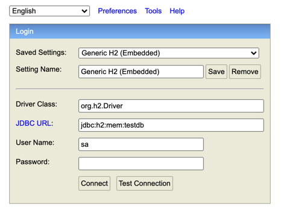
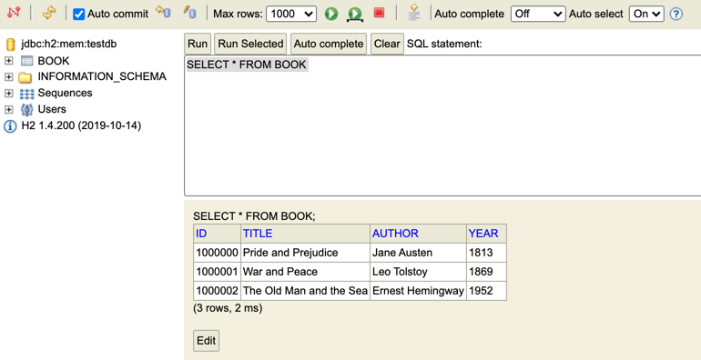

## ReadMe
### Book API reference Documentation
___
### Project requirements
* java11 - SDK for Development
* maven

### Build and Run
if you want to build and run the application directly from the project home folder
* mvn spring-boot:run

### (or)

### Build
you can build Spring boot application using the following command from the project home folder
* mvn clean install

### Build without Tests
If you want to skip the tests when building the application
* mvn clean install -DskipTests

### Execute the Spring Boot jar file
After successful build, you can be able to run the application
* java -jar target/exercise-0.0.1-SNAPSHOT.jar

### Shutdown the application
* press Control + C or Terminate/Close the command line window

___

### InOrder to Testing
* hello.sh to test the return value Hello World!
* listBooks.sh - Fetches all the books from the service
* addBook.sh - adds a new book to the service
    * addBook.sh - adds the same book again to the service to get **conflict** status in Response for the validation testing
* listBooks.sh - verify that a new book added in the result
* updateBook.sh - modify the new book's year field (**1951 -> 1953**)
* listBooks.sh - verify that a new book's year field modified in the result
* getBookById.sh - verify that get a single book has id (**1000000**)
* getBooksByAuthor.sh - verify that books has authored (**J. D. Salinger**)
* deleteBook.sh - delete the book has id (**1000003**)
* listBooks.sh - verify that the deleted book should not be in the result

___

### h2 Database console
* localhost:8080/h2
* 
* click Connect
*
* ( By default, 3 records are loaded in starting of the application for testing purpose only,
This is a temporary database for this application, and it will be automatically
clear the existing records and create the default records when application starting or restarting.
The ID of the table always start from "**_1000000_**" and it is auto generated for new book creation )
*
* select **_BOOK_** (table) on the left side (or) you can type "**_SELECT * FROM BOOK_**" in the query box
* click **_Run_** button to view the results of BOOK, like below screenshot

* 

---

## Testing

### User Credentials for BASIC simple Authentication
UserName : _**user**_  
Password : _**password**_

### Hello Controller
This controller does not require any authentication for its api calls

### Book Controller
This controller must require user authentication for all its api calls

### Test Scripts
Test scripts can be found in BookRestApi/src/test/scripts:
* hello.sh - Returns Hello World!
* listBooks.sh - Fetches all the books from the service
* addBook.sh - Adds a book to the service (consume data in JSON format)
* updateBook.sh - Updates a book to the service (consume data in JSON format)
* deleteBook.sh - Deletes a book from the service (by id)
* getBookById.sh - Fetches the book by id from the service
* getBooksByAuthor.sh - Fetches the list of books by author from the service

### 401 - UN AUTHORISED
* when you have a wrong username or password

### 404 - NOT FOUND
* when you have a wrong url
* when you have a wrong id to find the book, etc...

### 409 - Conflict
* when you're adding a book resource which is existing already
    * the unique scenario for book is (title and author and year)

## My Recommendations
Use the available test scripts : **BookRestApi/src/test/scripts/** (OR)  
**Postman and other restApi testing tools**

### Contact / Help / Feedback
* Author : Shanmuga
* Email  : srikishan2000@gmail.com